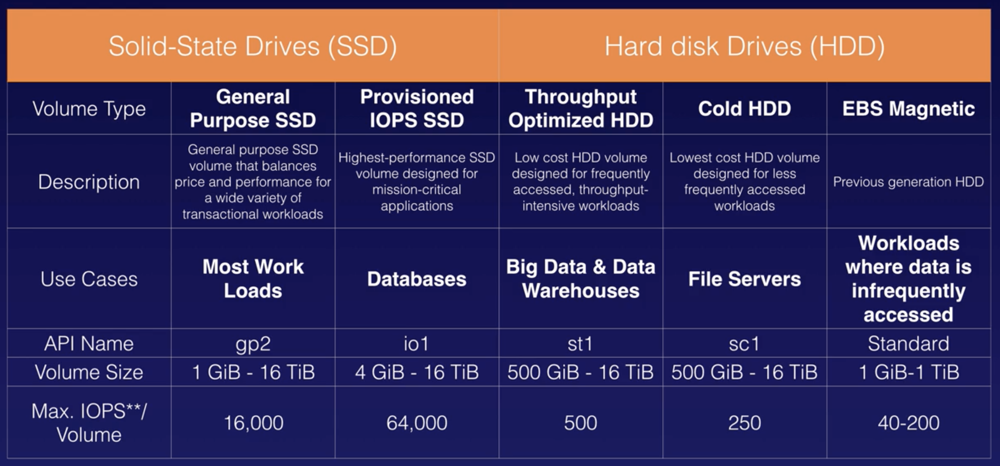

# EC2

- [EC2](#ec2)
  - [Instance Types](#instance-types)
  - [EBS](#ebs)
  - [Exam Tips](#exam-tips)
  - [Security Groups](#security-groups)
  - [EBS](#ebs-1)
  - [AMIs](#amis)
  - [Instance Metadata](#instance-metadata)
  - [EFS](#efs)

Elastic Compute Cloud: resizable compute capacity, VMs in the cloud. Reduces the time required to get, boot and scale server instances

Pricing Models:
- On Demand: 
  - Pay a fixed rate by the hour (or second) with no commitment
  - Use cases: 
    - Low cost and flexibility without commitment
    - Apps with short term, spiky or unpredictable workloads that cannot be interrupted
    - Apps being developed or tested on EC2 for the first time
- Reserved: 
  - capacity reservation at a discount, 1 or 3 year terms
  - Use cases:
    - Apps with steady state or predictable usage
    - Apps that require reserved capacity
    - Users can make up-front payments to reduce costs even further
      - Standard RIs (up to 75% off on-demand)
      - Convertible RIs (up to 54% off on-demand) you can change the attributes of the RI (as long as the result is of greater value, e.g. get a more expensive box)
      - Scheduled RIs: available to launch within the time window you reserve, for fractions of days, weeks, months
- Spot: 
  - Bid your own price for instance capacity
  - If a spot instance is terminated by EC2, you will not be charged for a partial hour of usage. If you terminate it, you will.
  - Use cases:
    - Apps that have flexible start and end times
    - Apps that are only feasible at very low compute prices
    - Users with an urgent need for large amounts of additional capacity
- Dedicated hosts: 
  - Physical EC2 servers dedicated for your use. Reduce costs by allowing you to use your existing server-bound software licenses
  - Can be purchased on-demand (hourly)
  - Can be purchased as a reservation for up to 70% off the on-demand price
  - Use cases:
    - Useful for regulatory requirements that may not support multi-tennant virtualization
    - Licensing which does not support multi-tenancy or cloud deployments
    

## Instance Types

| Family | Speciality                    | Use case                                                                     |
| ------ | ----------------------------- | ---------------------------------------------------------------------------- |
| F1     | Field Programmable Gate Array | genomics research, financial analytics, real time video processing, big data |
| I3     | High speed storage            | NoSQL DBs, Data warehousing                                                  |
| G3     | Graphics intensive            | Video encoding, 3D application streaming                                     |
| H1     | High disk throughput          | MapReduce-based workloads, distributed file systems such as HDFS and MapR-FS |
| T2     | Lowest cost, general purpose  | Web servers, small DBs                                                       |
| D2     | Dense storage                 | Fileservers, data warehousing, Hadoop                                        |
| R4     | Memory optimised              | Memory intensive apps, DBs                                                   |
| M5     | General purpose               | Application servers                                                          |
| C5     | Compute optimised             | CPU intensive apps, DBs                                                      |
| P3     | Graphics/General Purpose GPU  | Machine learning, bit coin mining                                            |
| X1     | Memory optimised              | SAP HANA, Apache spark                                                       |

Mnemonic: FIGHT DR MC PX

## EBS

Elastic Block Storage: allows you to create storage volumes and attach them to EC2 instances
- Create a file system
- Run a database

EBS volumes are placed in a specific Availability Zone, where they are automatically replicated 

Volume Types:
- General Purpose SSD (GP2)
  - Balances price and performance
  - Ratio of 3IOPS per GB with up to 10,000 IOPS and the ability to burst up to 3,000 IOPS for extended periods of time for volumes at 3334GiB and above
- Provisioned IOPS SSD (IO1)
  - Designed for I/O intensive apps such as large DBs
  - Use if you need more than 10,000 IOPS
  - Can provision up to 20,000 per volume
- Throughput Optimized HDD (ST1)
  - Big data, data warehouses, log processing
  - Cannot be a boot volume
- Cold HDD (SC1)
  - Lowest cost storage for infrequently accessed workloads
  - File server
  - Cannot be a boot volume
- Magnetic (standard)
  - Legacy
  - Lowest cost per GB
  - Bootable
  - Ideal for infrequently accessed data and low cost storage is important

## Exam Tips
- Termination protection is turned off by default
- EBS-backed instances, the default action is for the root EBS volumen to be deleted on termination
- EBS Root Volumes of your default AMIs cannot be encrypted.

## Security Groups

- Security group changes take effect immediately.
- Everything is blocked by default. You can't block ports or IPs, you can only allow traffic.
- All outbound traffic is allowed
- You can have multiple SGs attached to instances

## EBS
- Virtual hard disk in the cloud
- Block storage
- Automatically replicated within its AZ
- You can create snapshots of volumes (for example, to move them to different AZs)
- Snapshots are incremental
- You can create AMIs from volume snapshots
- You can created encrypted volumes or you can take a snapshot of an unencrypted volume and encrypt it
- Types
  - General Purpose (SSD)
  - Provisioned IOPS (SSD)
  - Throughput Optimised HDD
  - Cold HDD
  - Magnetic

## AMIs

You can select your AMI based on:
- Region
- OS
- Architecture
- Launch Permissions
- Storage for the root device:
  - Instance store (ephemeral storage)
    - Created from a template in S3
    - Cannot be stopped
    - If the host failes, you lose the data
  - EBS backed volumes
    - Created from EBS volumen snapshot
    - When you stop an instance, data is persisted

## Instance Metadata

From an EC2 instance you can access IP `169.254.169.254/latest/meta-data` for meta-data about the instance

## EFS

A file storage service for EC2 instances.

Storage capacity is elastic.

You can't share the same EBS volume between 2 instances, but you can share the same EFS instance.

Supports the NFSv4 protocol
You only pay for the storage you use
Scale up to the petabytes
Can support 1000s of concurrent NFS connections
Data is stored across multiple AZs
Read After Write consistency

## Placement Groups

- Clustered Placement Group
  - Grouping of instances within a single AZ
  - Recommended for apps that need low network latency, high network throughput or both
  - Only available for certain instances
  - Can't span multiple AZ
- Spread Placement Group
  - Instances are placed on distinct underlying hardware
  - Recommended for apps that have a small number of critical instances that should be kept separate from each other
- Partitioned Placement Group
  - EC2 divides each group into logical segments called partitions
  - EC2 ensures that each partition within a placement group has its own set of racks. Each rack has its own network and power source.
  - No two partitions within a placement group share the same racks, allowing you to isolate the impact of hardware failure
  - 